# Enterprise Data Pipeline: Supply Chain & Procurement Intelligence

**A high-performance asynchronous ETL suite engineered to modernize vendor data retrieval and drive data-backed procurement decisions.**

---

## Business Impact & ROI

In typical procurement workflows, maintaining accurate pricing for hundreds of SKUs is a labor-intensive manual process. This solution transforms that friction into efficiency:

*   **98% Time Reduction:** Automated data collection reduced processing time from hours of manual entry to **under 60 seconds**.
*   **Cost Optimization:** Real-time tracking of price fluctuations across volatile SKUs enables proactive budget management and prevents overpayment.
*   **Strategic IQ:** Feeds a master analysis suite where **Pivot Tables** and **Historical Trends** empower leadership with actionable quarterly insights.

---

## Technical Implementation

This project demonstrates a robust application of modern Python patterns and enterprise-standard data handling.

### Core Stack
*   **Asynchronous Processing:** Built with `httpx` and `asyncio` to handle high-concurrency API requests safely and efficiently.
*   **Data Engineering:** Leverages `pandas` for advanced deduplication, path management, and structured CSV serialization.
*   **Security & Portability:** Environment-driven configuration (`python-dotenv`) ensures total anonymization of proprietary endpoints, while cross-platform binary builds (PyInstaller) enable deployment on Windows, macOS, and Linux.

---

##  Workflow Architecture

```mermaid
graph TD
    A["📄 products.txt (Input)"] --> B{"🐍 Python ETL Engine"}
    B --> C["🔐 .env (Secure Config)"]
    B --> D["📊 export.csv (Output)"]
    D --> E["🤖 Power Automate Desktop"]
    E --> F["📑 SharePoint Master Excel"]
    F --> G["📈 Data Analysis Suite"]
    G --> H["🎯 Strategic Decisions"]

    style B fill:#f9f,stroke:#333,stroke-width:2px
    style D fill:#bbf,stroke:#333,stroke-width:2px
    style H fill:#dfd,stroke:#333,stroke-width:2px
```

### The Data Lifecycle
1.  **Extract:** Python scripts utilize custom semaphores to batch-pull live data from RESTful vendor APIs without exceeding rate limits.
2.  **Automate:** Power Automate Desktop monitors for output, instantly syncing results to centralized business intelligence layers.
3.  **Analyze:** Automated data appending creates a historical baseline for year-over-year pricing and inventory volatility analysis.

---
> **Compliance & Privacy:** To protect corporate IP, all proprietary vendor branding, endpoints, and authentication schemas have been externalized to local environment variables.
